 

 

## About

I'm **Nekuzaky**, an open-source developer and founder of [Altcore](https://www.nekuzaky.com/).  
I build tools, game systems, Discord bots, and Minecraft mods — focused on clean architecture and real utility.

- Unity / C# — modular game tools, scriptable systems, game jam frameworks
- JavaScript / TypeScript — web applications, bots, and browser-based tools
- Java / Fabric — Minecraft mod development, custom mechanics and gameplay systems
- Founder of [Altcore](https://www.nekuzaky.com/) — tools for developers, creators, and gamers

 

## Stack

 

## Projects

| Repository | Description | Tech |
|---|---|---|
| [UNITY-3D_TOOLKIT](https://github.com/Nekuzaky/UNITY-3D_TOOLKIT) | 300+ decoupled, scriptable-ready C# scripts for Unity game jams | C# · Unity |
| [EasyBot-Discord](https://github.com/Nekuzaky/EasyBot-Discord) | Modular, open-source Discord bot framework | JavaScript |
| [SanityCraft](https://github.com/Nekuzaky/SanityCraft) | Minecraft mod introducing a sanity system and psychological survival mechanics | Java · Fabric |
| [BetterController](https://github.com/Nekuzaky/BetterController) | Native Xbox, PlayStation and Switch controller support for Minecraft Java | Java · Fabric |
| [Altcore-Meme-Studio](https://github.com/Nekuzaky/Altcore-Meme-Studio) | Fast, template-based meme generator built with React and TailwindCSS | TypeScript · React |
| [Altcore-Tools-Studio](https://github.com/Nekuzaky/Altcore-Tools-Studio) | Online toolbox for developers, creators and gamers | TypeScript |

 

## Stats

&nbsp;

 

## Contact

- [nekuzaky.com](https://www.nekuzaky.com/)
- [contact@nekuzaky.com](mailto:contact@nekuzaky.com)
- [@nekuzaky](https://twitter.com/nekuzaky)

 

